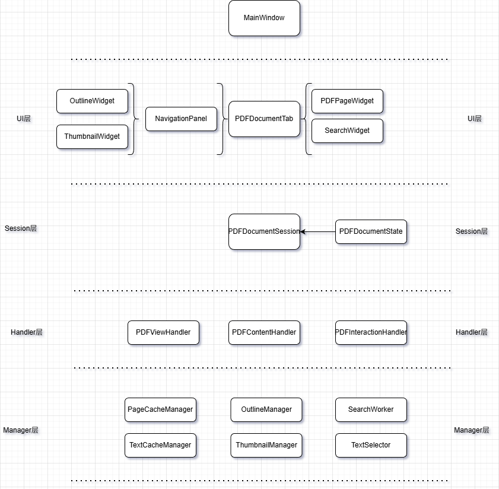

# MuQt 架构设计

## 整体架构

项目采用分层架构，从高到低依次为：**UI 层 → Session 层 → Handler / Cache / Renderer 层 → Model / Manager / Tool 层**，此外还有横切的 Util 工具包。

设计原则：上层依赖下层；跨层访问必须通过明确的对象职责和公开契约完成。这个项目不强制把
所有调用都塞进 Session：`PDFDocumentSession` 是每个文档的运行时容器（composition root），
负责装配和销毁文档对象，而不是承担所有业务的 God Object。

---

## 各层说明

### UI 层

负责界面布局，响应用户事件，接收 Session 层信号更新界面。

- **MainWindow**：主窗口，包含菜单栏、工具栏、Tab 页
- **PDFDocumentTab**：单个 Tab 页，包含导航栏（NavigationPanel）和页面（PDFPageWidget）
- **NavigationPanel**：导航栏，包含大纲（OutlineWidget）和缩略图（ThumbnailWidget）
- **SearchWidget**、**OutlineDialog**：独立小组件

`PDFDocumentTab` 是一个复合 View 与呈现协调者（presentation coordinator）：它可以处理视口、
滚动、菜单、浮层，以及把鼠标/快捷键转换为用户意图；它也可以访问 Session 持有的 Renderer、
Cache 和 Handler 的公开接口。它不负责 PDF 持久化事务、后台任务有效期等跨服务业务规则。

---

### Session 层

应用最核心的一层。UI 层以 Session 作为当前文档的服务入口和生命周期边界；UI 可按职责直接调用
Session 持有的 Handler、Cache 或 Renderer 的公开接口。Session 同时向 UI 层发送文档级状态信号。

- **PDFDocumentSession**：核心对象，管理 Handler、State、Renderer、Cache 的生命周期
- **PDFDocumentState**：PDF 核心状态数据（页码、缩放、显示模式等）
- 每个 Tab 页拥有独立的 Session，多 Tab 之间数据完全隔离

Session 只做文档级对象装配、生命周期和必要的共享状态同步。新增能力优先作为独立 Handler /
Manager 由 Session 持有并暴露，而不是持续扩大 Session 的业务 API。

---

### Handler 层

Session 不直接处理业务，而是分发给具体 Handler。Handler 是真正干活的地方。

| Handler | 职责 |
|---------|------|
| **PDFContentHandler** | 打开 / 关闭 PDF，加载大纲和缩略图数据 |
| **PDFViewHandler** | 管理视图状态：页码跳转、缩放、显示模式切换 |
| **PDFInteractionHandler** | 用户交互：文本选择、搜索、链接跳转 |
| **PDFAnnotationHandler** | 钢笔、橡皮等批注输入操作 |
| **PDFPersistenceHandler** | 协调目录与批注的保存事务、聚合未保存状态、处理保存后的页面缓存失效 |
| **PDFBackgroundTaskHandler** | 为每个文档的后台任务分配代次令牌，使关闭/重开文档后的旧结果失效 |

Handler 不持有文档状态的唯一事实来源；它可持有必要的短期交互状态，文档状态来自 Session 的 State，
领域数据来自 Manager / Model 层。

其中 `PDFPersistenceHandler` 与 `PDFBackgroundTaskHandler` 是横向协调 Handler：前者协调多个
持久化能力，后者只管理任务有效期；它们不重新实现目录、批注、搜索或文本提取本身。

---

### Cache 层

Session 管理两类缓存：

- **TextCacheManager**：文本缓存，为搜索、文本选择及未来批注功能提供数据
- **PageCacheManager**：页面缓存，存储已渲染页面，减少重复渲染，提升流畅度

---

### Renderer 层

封装 MuPDF API，为上层提供统一的渲染接口。

MuPDF 的 context / document 不能跨线程共享，因此每个线程（主线程 / 线程池中的线程）持有独立的 Renderer 实例。

---

### Manager 层

为 Handler 提供数据支撑，Handler 本身不持有业务数据。

- **OutlineManager**：大纲数据
- **ThumbnailManagerV2**：缩略图数据
- **SearchManager**：搜索功能

---

### Model 层 / Tool 层

辅助层，提供数据建模和通用工具，供其他模块复用。非 MVC / MVVM 意义上的 Model。

---

## 职责分类与目录约定

目录名称不是唯一的设计边界；新增代码首先按职责落位，而不是为了形式重命名已有文件。

| 职责 | 责任边界 | 当前目录 / 代表对象 |
|---|---|---|
| Presentation / View | 布局、绘制、滚动、菜单、鼠标键盘、浮层 | `ui/`：`PDFPageWidget`、`SearchWidget`、`OutlineWidget` |
| Presentation Coordinator | 将 UI 事件转成用户意图，协调多个 Widget | `ui/`：`PDFDocumentTab`、`NavigationPanel`、`MainWindow` |
| Document Context | 每个文档的对象装配和生命周期 | `session/`：`PDFDocumentSession` |
| Application Handler | 一类用户操作或跨服务流程 | `handler/`：Content / View / Interaction / Annotation / Persistence / BackgroundTask |
| Domain Model | 不依赖具体 UI 或 PDF 引擎的数据与规则 | `model/`、`session/`：`OutlineItem`、`InkStroke`、`PDFDocumentState` |
| Aggregate / 数据管理 | 持有某一领域集合并维护内部一致性 | `manager/`：`AnnotationManager`、`OutlineManager` |
| Cache | 缓存命中、淘汰与失效，不决定业务流程 | `manager/`、`model/`：Page/Text/Thumbnail Cache |
| Infrastructure Adapter | MuPDF、OCR、文件系统、外部词典等外部系统接入 | `core/`、`ocr/`、`tool/`、`util/` |

### 新增代码规则

1. 新增 Widget、菜单、视口或纯交互反馈，放入 `ui/`。
2. 新增“用户执行某件事”的流程，放入 `handler/`；Handler 可以协调多个现有对象，但不复制其实现。
3. 新增 PDF / OCR / 文件系统 / 外部应用调用，放入 `core/`、`ocr/`、`tool/` 或 `util/`。
4. 新增数据结构或不依赖界面的业务规则，放入 `model/`；若是文档状态，可放入 `session/`。
5. `manager/` 只新增单一资源或集合的管理对象；不要把 UI 流程、PDF 写入和线程编排混进泛化 Manager。

现有目录无需一次性迁移。后续只在某个文件因功能修改而出现明确的第二职责时，做小范围移动或拆分；
避免为了目录整洁制造大规模 include 和构建变更。

---

## 所有功能都受制的底层约束

MVC、OOP、DDD 只是组织代码的具体手法。无论采用什么范式，系统都会面对下面三组不可消除的
约束；它们是判断职责边界时优先于“类应该叫什么”的标准。

### 1. 数据与变换

程序始终需要表达“当前是什么”和“如何变成下一状态”。名称可以是对象与方法、数据与函数、
实体与事务，但本质都是状态与作用于状态的逻辑。

在 OwlPDF 中，`PDFDocumentState`、`OutlineItem`、`InkStroke`、搜索结果和缓存属于数据；
页码跳转、文本搜索、目录编辑、笔迹编辑等属于变换。

### 2. 纯计算与副作用

几何计算、文本匹配、分词等可以尽量保持可重复、可推演；读写 PDF、调用 MuPDF / OCR、启动外部
词典、更新 Qt 界面都会接触外部世界，可能失败、延迟或受环境影响。副作用应尽量集中在明确的
基础设施边界，而非散落在业务状态和 UI 判断中。

### 3. 做事与编排

当一个用户动作需要多个组件共同完成时，必然需要一个对象决定顺序、失败语义和一致性。
例如“保存文档”要协调目录、批注和页面缓存；“关闭文档”要协调搜索、预加载和资源释放。

具体能力仍由各自对象完成；跨对象的顺序和一致性由 Handler 或其他明确命名的协调对象负责。
`PDFPersistenceHandler` 与 `PDFBackgroundTaskHandler` 就属于这一类。

### 横切维度：时间与生命周期

时间不是第四种独立职责，却贯穿前三者：状态何时有效、对象由谁拥有、异步结果何时过期、
副作用能否取消、关闭文档后哪些回调必须失效。任何后台任务都必须定义启动、取消、完成、
文档关闭和过期结果处理的语义。

实际评审一个类或一段代码时，应能回答：它是在保存状态、变换状态、执行副作用，还是协调这些
事情的顺序与生命周期？若无法回答，通常说明职责尚未清晰。

---

## 后台任务与持久化约定

### 后台任务

搜索、文本预加载、缩略图和 OCR 都可能在 UI 请求已失效后才返回结果。文档关闭、重新打开或重新发起
同类任务时，旧结果不得写入当前文档状态或刷新当前 UI。

`PDFBackgroundTaskHandler` 维护两层代次：文档代次与任务代次。已接入的搜索和文本预加载在发起时取得
令牌，任务完成后只有令牌仍为当前代次时才提交结果。新增后台任务应沿用这一规则，或提供等价的取消与
过期结果过滤机制。

### 持久化

一次“保存文档”可能同时涉及目录、批注和渲染缓存。此类跨组件一致性规则由
`PDFPersistenceHandler` 协调：

1. 查询并聚合目录与批注的未保存状态；
2. 分别调用既有的目录与批注写入实现；
3. 批注写回成功后使页面缓存失效，并通知视图重绘；
4. 向 UI 返回统一的保存结果。

View 可以触发保存并展示错误，但不应再自行决定“保存后哪些缓存必须清除”。

---

## 性能优化

### 缩略图加载策略

针对不同规模的 PDF 采用差异化加载方案，优先解决"卡顿"问题：

| PDF 规模 | 页数 | 策略 |
|---------|------|------|
| 小型 | < 50 页 | 同步渲染，速度足够快 |
| 中型 | 50 – 400 页 | 线程池批量加载（4 线程 × 5 页/批 = 一次性加载 20 页） |
| 大型 | > 400 页 | 按需加载：优先可见区 → 滚动时分批加载 → 停止滚动 / 跳页时补全 |

> 当前不足：大中小 PDF 的划分阈值和批次大小均为经验值，尚未基于实测数据调优。

### 页面缓存

渲染完成的页面存入 PageCacheManager，翻页时优先命中缓存，避免重复渲染。

### 全文文本缓存

PDF 文本内容在打开时异步预加载到 TextCacheManager，搜索和文本选择操作直接读取缓存，无需实时解析。
