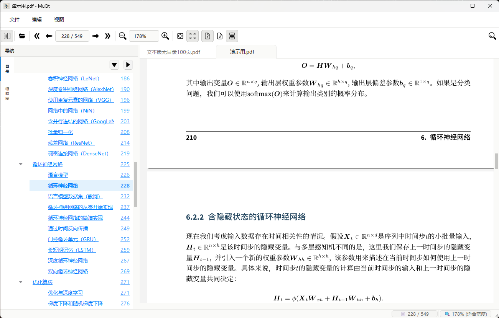
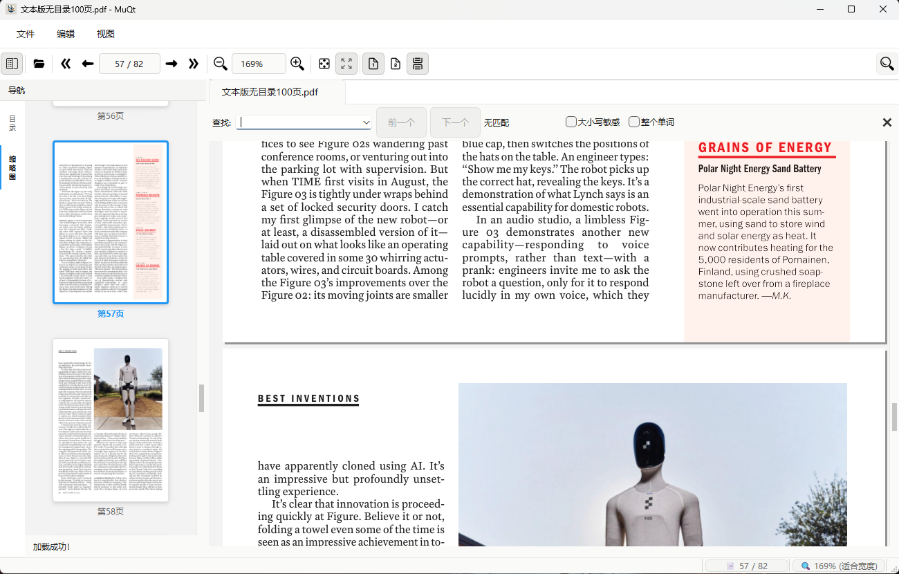
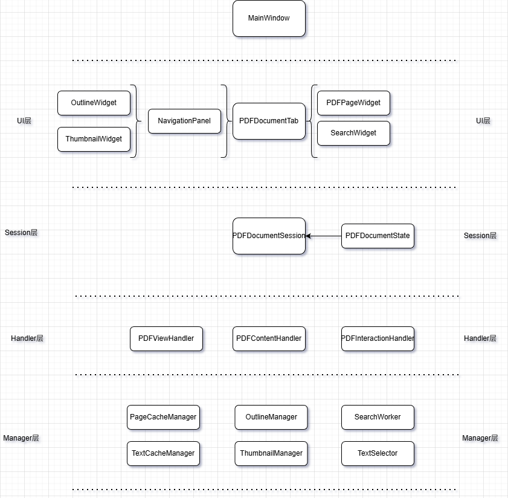

# MuQt Reader

一个基于 Qt 和 MuPDF 的现代化 PDF 阅读器，采用模块化架构设计，目标是提供流畅的阅读体验和强大的功能。

## 界面展示

## 主要特性

### 阅读功能
- **多种显示模式**：单页、双页、连续滚动
- **灵活缩放**：适应页面、适应宽度、自定义缩放（25% - 400%）
- **多标签页**：同时打开多个 PDF 文档
- **导航面板**：大纲、缩略图预览

### 交互功能
- **全文搜索**：支持大小写敏感、全字匹配(目前是当前页，测试功能OK后做全文搜索)
- **文本选择**：字符级、单词、整行、自由方式多种选择文本方式，可复制文本
- **大纲编辑**：添加、删除、重命名目录项

### 用户界面
- **现代化设计**：参考 PDF Expert 的简洁风格，黑白主色调、简洁大方、纸质感、现代优雅
- **响应式布局**：自适应窗口大小变化
- **快捷键支持**：完整的键盘导航
- **工具栏**：直观的操作按钮和状态显示

### 实验功能
- **护眼纸质感**：利用OpenCV实现扫描版PDF护眼纸质感体验！
- **OCR悬停取词**：基于强大的中英文OCR技术PaddleOCR实现的悬停取词功能，方便与外部工具(如GoldenDict-NG)互动

## 分层设计

## 核心组件说明

项目采用分层架构，从高到低是UI层、Session层、Handler/Cache/Renderer层、Model/Manager/Tool层，此外还有Util工具包。

目前的技术方案是上层依赖下层，不跨层调用(目标，代码正往这个方向调整)。

### UI层

主窗口是MainWindow，包含菜单栏、工具栏、Tab页。Tab页为PDFDocumentTab,PDFDocumentTab包含导航栏和页面。导航栏为NavigationPanel，包括
大纲和缩略图，大纲为OutlineWidget，缩略图为ThumbnailWidget。页面为PDFPageWidget。

此外，还有一些小组件：SearchWidget、OutlineDialog。

UI层负责界面布局，响应各种事件，接受Session层的信号更新UI。

### Session层

Session层是这个应用最重要的一层。UI层的交互全部委托给Session层，由Session层根据职责分发给不同的Handler，同时UI层接受Session层的信号更新UI。

Session即PDFDocumentSession，主要管理Handler、State、Renderer、Cache，这4者的生命周期由Session负责。

每个Tab页都有一个Session，多个Tab页不共享数据，即Session是隔离的。PDF的核心状态数据维护在Session的State里，State为PDFDocumentState。

### Handler层

Session本质上不干业务重活，负责分发业务给具体的Handler。Handler在应用中真正负责干活。目前划分为3个Handler：PDFViewHandler、
PDFContentHandler、PDFInteractionHandler。

PDFContentHandler负责打开PDF、关闭PDF，同时负责大纲和缩略图数据的加载。

PDFViewHandler负责管理视图状态：页码跳转、缩放、显示模式。

PDFInteractionHandler负责用户交互，比如选择文本、搜索、链接跳转。

### Cache层

Session管理PDF的一些缓存数据。包括文本缓存、页面缓存，文本缓存为TextCacheManager，为搜索、选择文本以及未来的批注功能提供数据支援；页面缓存
为PageCacheManager，渲染好的页面存放到缓存中，提升阅读体验，减少加载页面耗时。

### Renderer层

PDF的底层是有MuPDF提供渲染能力的，Renderer层封装了MuPDF的API，方便其他模块使用。由于MuPDF的context/document不能在多线程中混用，而是每个
线程(主线程/线程池里的线程)使用自己的Renderer，关于这点，还在想办法提升性能。

### Manager层

Handler层只负责处理业务，它不持有状态和数据，状态来自Session的State，数据来自Manager，比如大纲数据由OutlineManager提供，缩略图
由ThumbnailManagerV2提供。还有一些交互功能也由相应的Manager来提供，比如搜索来自SearchManager。

### Model层/Tool层

辅助层，为其他模块提供数据建模，并非MVC或MVVM的Model。同样的，Tool层类似。

## 性能优化

### 页面缓存
### 缩略图加载
### 全文文本缓存加载

## 依赖库版本
- Qt6: 6.10.0
- MuPDF: 1.26.11
- OpenCV: 4.12.0
- onnxruntime: 1.23.2
- paddleocr: v5模型
- rapidocr: 3.4.2 (非直接依赖，C++代码实现参考了其Python实现)
- Clipper2: 1.5.4

## 致谢

- [MuPDF](https://github.com/ArtifexSoftware/mupdf)
- [Qt Framework](https://www.qt.io/)
- [OpenCV](https://github.com/opencv/opencv)
- [PaddleOCR](https://github.com/PaddlePaddle/PaddleOCR)
- [RapidOCR](https://github.com/RapidAI/RapidOCR)
- PDF Expert - UI 设计灵感来源

## 联系方式

- 项目主页: https://github.com/techfs2026/MuQt

## Star History

如果这个项目对你有帮助，请给个 Star ⭐️

---
