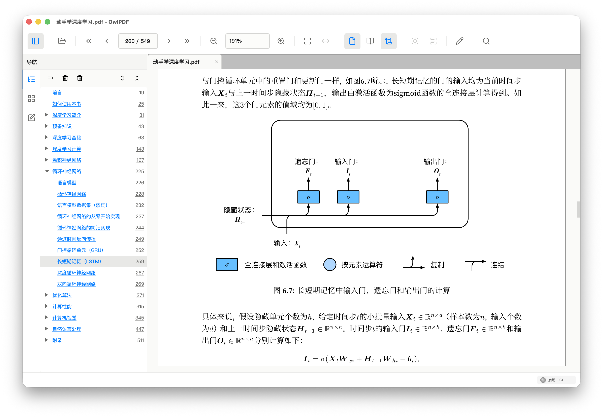
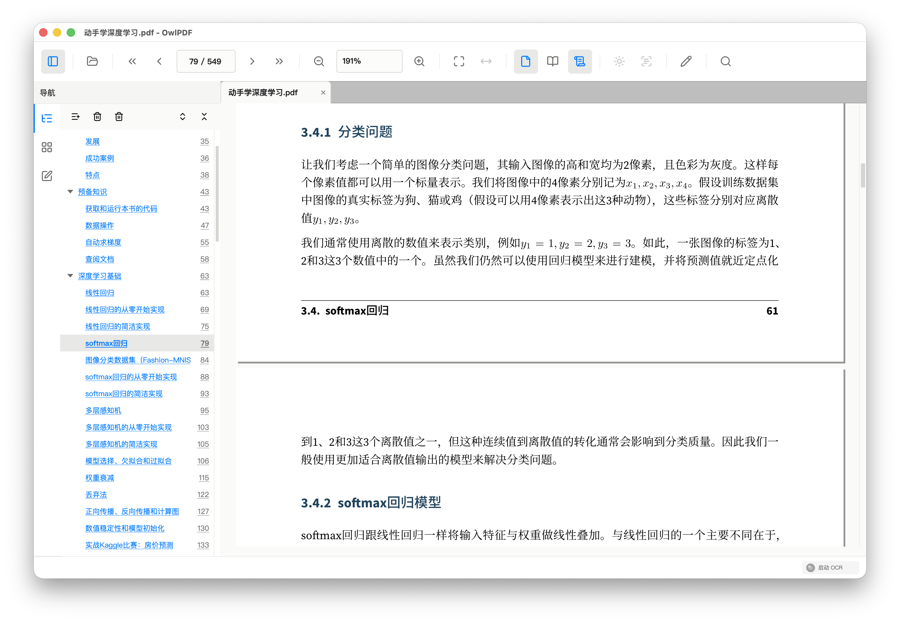
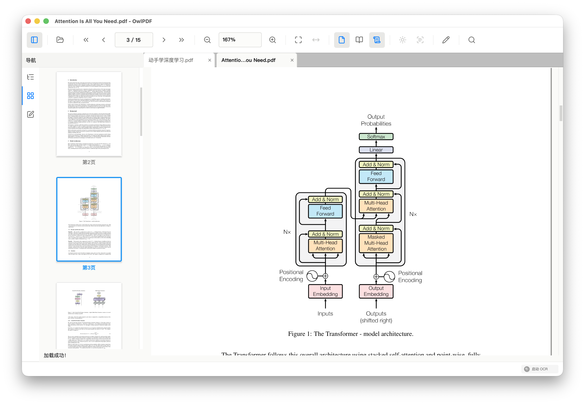
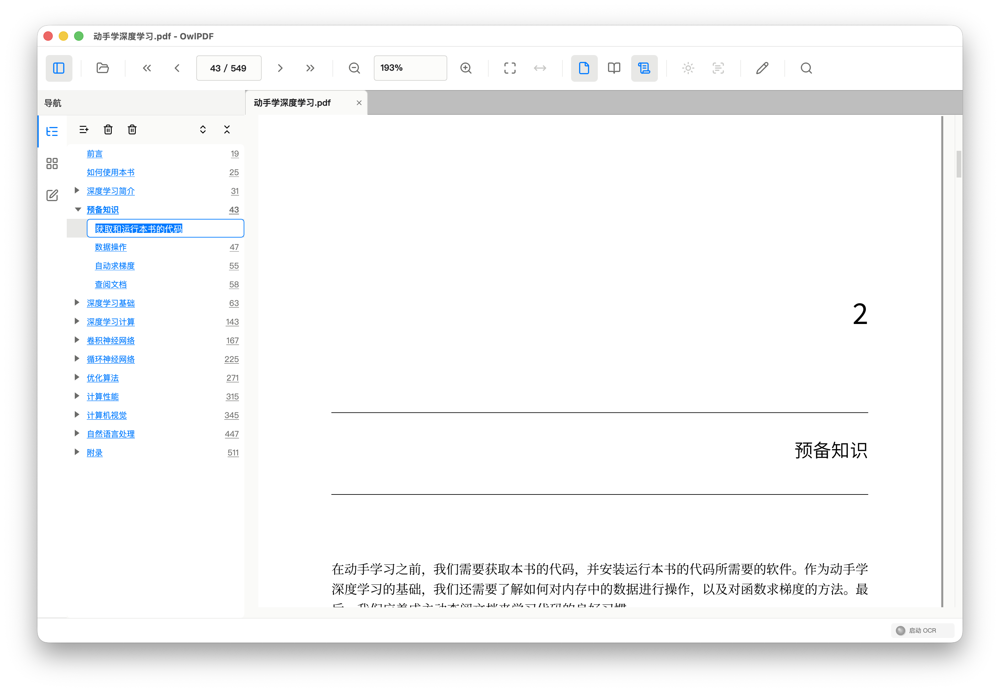
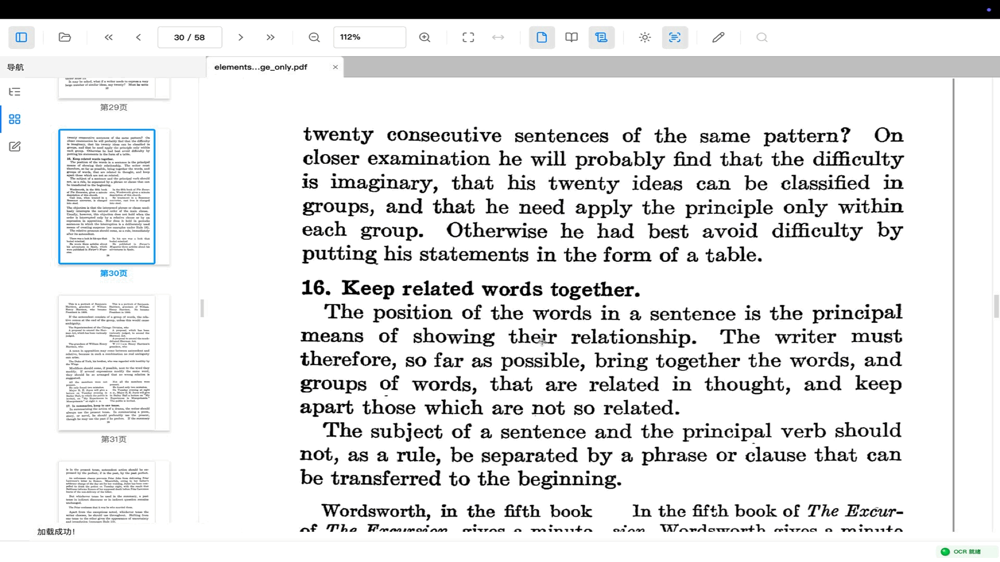
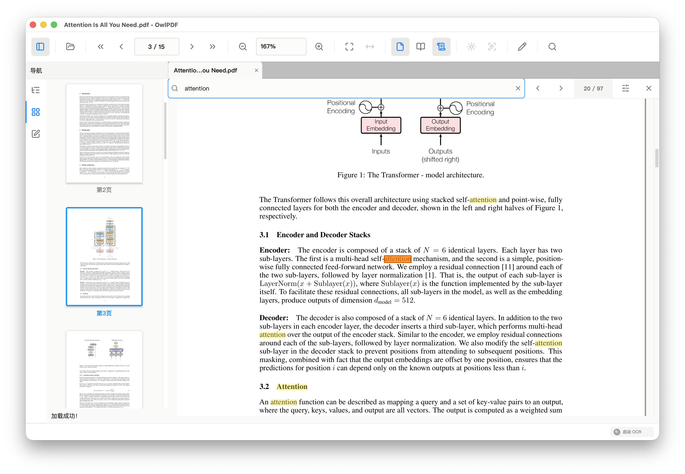
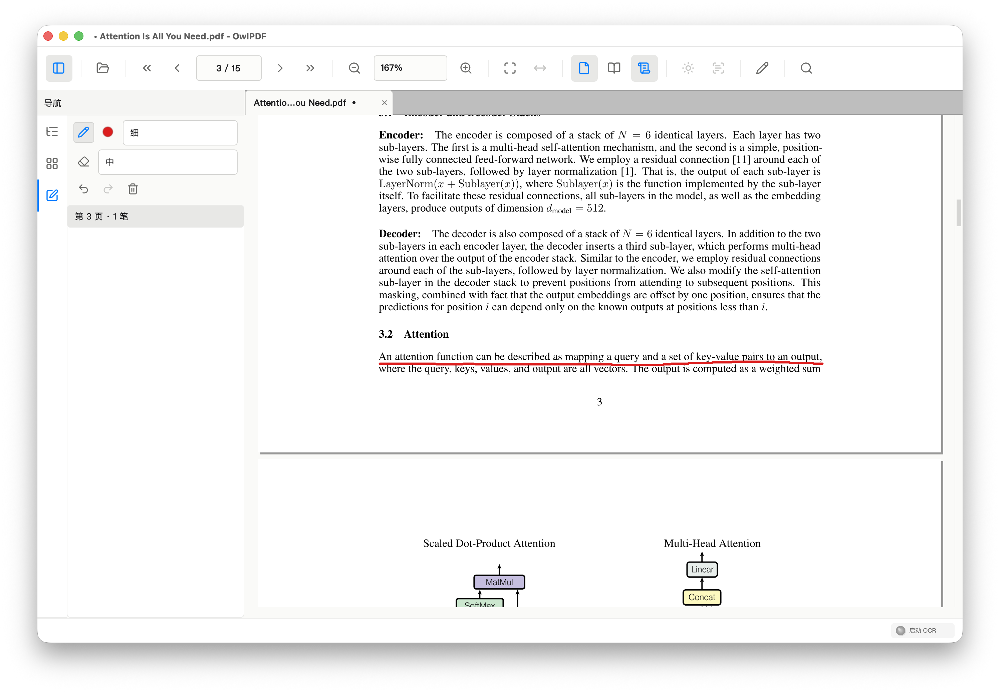

# OwlPDF

OwlPDF 是一款基于 Qt + MuPDF 构建的跨平台桌面 PDF 应用，面向需要长时间阅读、查找、取词和整理资料的人。

OwlPDF 不追求成为一个庞大的 PDF 编辑器，而是把重点放在更日常的阅读场景：打开一本书，顺畅翻阅；在文本型 PDF 文档里快速定位；在扫描件里降低阅读负担；遇到外文或生词时尽量少打断思路。

> 当前项目仍处于自用和打磨阶段，核心阅读功能已经可用，部分高级功能还在持续完善。

## 界面预览

主窗口



连续滚动



缩略图



编辑目录



OCR悬停取词



搜索



批注-钢笔、橡皮



## 适合用来做什么

- 阅读教材、论文、技术文档、杂志和长篇资料
- 在大文档中通过目录、缩略图、页码和搜索快速定位
- 同时打开多份 PDF，方便对照阅读
- 阅读扫描版 PDF 时开启纸质增强，减轻刺眼感 (实验功能)
- 对扫描件使用 OCR 取词，并调用外部词典查询
- 在页面上做钢笔批注，可通过橡皮擦除，并保存回 PDF

## 已支持功能

### 阅读体验

- 单页、双页、连续滚动三种阅读方式
- 适合页面、适合宽度、自定义缩放
- 多标签页阅读
- 页码跳转、首页/末页、上一页/下一页
- 目录导航、缩略图导航
- 打开上次会话，恢复常用阅读环境

### 搜索与选择

- 文本型 PDF 全文搜索
- 支持大小写敏感、整词匹配
- 搜索结果高亮与上一处/下一处跳转
- 文本选择、复制
- 选择单词、整行、全文
- 选中文本后可查词 (需配置词典应用，比如GoldenDict-ng)

### 扫描件阅读

- 扫描版 PDF 纸质增强 （实验功能）
- OCR 悬停取词
- macOS 使用系统 Vision 框架
- Windows 使用 RapidOCR / PaddleOCR 模型
- 可配置外部词典命令，例如 GoldenDict-ng

### 批注与目录

- 墨迹批注
- 橡皮擦
- 批注撤销/重做
- 批注保存回 PDF
- 目录添加、删除、重命名、移动
- 目录改动保存回 PDF
- 保存前自动创建备份，降低误操作风险

## 快捷键

| 操作 | 快捷键 |
| --- | --- |
| 打开文件 | Ctrl+O / Cmd+O |
| 保存改动 | Ctrl+S / Cmd+S |
| 搜索 | Ctrl+F / Cmd+F |
| 复制选中文本 | Ctrl+C / Cmd+C |
| 上一页 / 下一页 | PageUp / PageDown |
| 首页 / 末页 | Home / End |
| 适合页面 | Ctrl+1 / Cmd+1 |
| 适合宽度 | Ctrl+2 / Cmd+2 |
| 显示/隐藏导航栏 | F9 |
| 显示/隐藏工具栏 | F11 |
| 开启 OCR 取词模式 | Ctrl+Shift+O / Cmd+Shift+O |
| 触发当前位置 OCR | Ctrl+Q / Cmd+Q |
| 撤销/重做批注 | Ctrl+Z / Ctrl+Y |

## 使用建议

### 词典配置

外部词典命令可在设置中配置，例如 MacOS 下配置：

```bash
/Applications/GoldenDict-ng.app/Contents/MacOS/GoldenDict-ng {word}
```

### 保存批注和目录

墨迹批注和目录编辑都需要保存后才会写回 PDF。保存时 OwlPDF 会在应用数据目录中创建备份文件，方便在异常情况下回退。

## 当前限制

- 文本选择和搜索主要面向带文本层的 PDF
- 当前批注以钢笔为主，高亮、划线、评论和批注导出仍在开发计划中
- 目录和批注会写回 PDF，建议重要文件保留额外备份

## Roadmap

- 文本高亮、划线和评论批注
- 批注列表、批注导出 Markdown / 纯文本
- 链接跳转后的后退/前进历史
- 中文双击选词优化
- 框选 OCR
- 扫描件去黄、锐化、去黑边、自动纠偏
- 打印支持

## 技术栈

| 模块 | 技术 |
| --- | --- |
| 界面 | Qt 6 |
| PDF 渲染 | MuPDF |
| 扫描增强 | OpenCV |
| macOS OCR | Apple Vision |
| Windows OCR | RapidOCR / PaddleOCR / onnxruntime |
| 中文分词 | cppjieba |

更详细的工程设计见 [ARCHITECTURE.md](ARCHITECTURE.md)。

## 致谢

- [MuPDF](https://github.com/ArtifexSoftware/mupdf)
- [Qt Framework](https://www.qt.io/)
- [OpenCV](https://github.com/opencv/opencv)
- [PaddleOCR](https://github.com/PaddlePaddle/PaddleOCR)
- [RapidOCR](https://github.com/RapidAI/RapidOCR)
- [cppjieba](https://github.com/yanyiwu/cppjieba)

OwlPDF 的界面和交互理念受到 PDF Expert 等优秀阅读工具启发。

## 项目地址

https://github.com/techfs2026/OwlPDF
